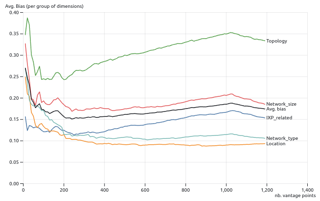

# Table of Contents

- [Introduction](#introduction)
- [Tool 1: Bias in Internet Measurement Platforms](#chapter-1-bias-in-internet-measurement-platforms)
- [Tool 2: Extending Monitoring Infrastructure in an unbiased way](#chapter-2-extending)

## Introduction 

There are 2 basic visualization tools for the AI4NetMon project, in Observable notebooks, that the public can use in order to get various insights of collected data in IMPs, their bias, and various interesting insights of them.

## Tool 1: Bias in Internet Measurement Platforms 

### Bias in IMPs and custom lists of ASNs

Provide detailed information about the bias present in Internet measurement platforms and the importance of addressing it.
This notebook visualizes the bias in Internet measurement platforms, based on the analyses of the AI4NetMon project, using radar plots. For an introduction on the bias of Internet measurement platforms see the [RIPE Labs article](https://labs.ripe.net/author/pavlos_sermpezis/bias-in-internet-measurement-infrastructure/).

The following radar plot shows:
show the possible selections the user can make

- the bias; from 0 (low bias, center of the circle) to 1 (high bias, far from center)
- for each selected set of monitors (lines/areas of different colors)
- along different bias dimensions (each radius of the circle)

Also, the user can upload any custom set of monitors to compare their bias, except from the two IMPs, and select which sets of monitors / bias dimensions to visualize.
The bar on the top of the image is where the user puts the ASNs. Regarding those selections, the radar plot updates dynamically.

### Bias in RIPE RIS per Route Collector

In more detail, apart from the bias in IMPs, there is another visualization to show bias especially in RIPE RIS platform, per Route Collector. The user can use the selections in the screenshot below, to pick which Route Collectors appear in the radar plot.

Again, the user can select which dimensions to appear on the radar plot. The corresponding radar plot is shown below:

As we can see, in the screenshot three dimensions are not selected, #IXPs, Scope and Personal ASN, so they are not visible in the radar plot either.

### Bias vs. volume of information

Some more interesting visualizations, using radar plots and line charts, concern the bias in subsets of peers of the RIPE RIS and RouteViews projects, where the subsets are selected by the Most Valuable Points (MVP) methodology of the [MVP paper](https://dl.acm.org/doi/abs/10.1145/3517745.3563031) and their online API.
Given a threshold of volume of information (e.g., RIBs of 5GBs) of number of vantage points (e.g., 100 peers), the MVP selects a subset of peers of RIPE RIS and RouteViews that are "most dissimilar" and bring "the more useful information with fewer data".

So, in the following visualization we compare the bias of (a) the entire set of RIPE RIS and RouteViews vantage points / peers with (b) their subset selected by MVP. The size of the subset can be selected; default value is 50 vantage points.

In the first plot, we see the bar to be used, in order to choose the number of vantage points returned by MVP.

Then, the corresponding radar plot follows

Furthermore, the following figure, presents again the bias values per group of dimensions. For example the "Location" line corresponds to the average bias across the three dimensions "RIR region", "Country" and "Continent". The black line corresponds to the average bias (among all dimensions) of the MVP sets of vantage points vs. the number of vantage points (x-axis).

## Tool 2: Extending Monitoring Infrastructure in an unbiased way 

### Extending RIPE Atlas in an unbiased way

This notebook provides recommendations for extending the RIPE Atlas infrastructure (i.e., selecting ASes to deploy RIPE Atlas probes) in an "unbiased way", based on the results and analyses of the AI4NetMon project.

The recommendations are provided as follows: For every AS that does not host any RIPE Atlas probe, we calculate what would be the difference in bias if we deploy at least one probe in it. Hence, we calculate a bias difference score. Adding an AS can decrease or increase bias. We would prefer to decrease the bias, thus, we would prefer to add (if possible) the ASes that have the most negative bias difference score. Below, the top-5 recommendations table appears, but there is also a more detailed table that is described after the screenshot.

The detailed recommendation table shows for the ASNs that do not host any RIPE Atlas probe the following data:

- Bias difference score: That is the difference in bias they can bring if added to the RIPE Atlas infrastructure (i.e., deploy at least on probe). Negative values mean that the bias is decreased, and positive values that the bias is increased. The smaller the value the more the bias is decreased (e.g., -1% is better than -0.5%).

- Network characteristics: Some characteristics of the ASNs, e.g., size, customer cone, neighbors, network type, peering policies, connectivity to IXPs, etc.
The table is by default sorted by the TOTAL bias difference score, with first appearing the ASNs with the smaller bias difference scores (i.e. those that would be most preferred). You can sort the table by other columns and by ascending/descending order by clicking on the headers.

**Filtering and bias calculation options**
We provide a number of filtering and modifications options that enable to adapt the recommendations based on specific needs, constraints, etc. For example, we may want to take into account only location bias or we may want to consider only ASNs with a PeeringDB record. Using these options, the recommendations data table is updated automatically.

The bias (score) is calculated based on many different characteristics (location, network size/type, connectivity, etc.). We may not want to take into account all these dimensions, or we may want to put more weight on some of them. To this end, we provide below the option for the user to select a weight (from 0 to 1) for each group of dimensions. The TOTAL bias difference score is calculated as the weighted sum of the bias difference scores per dimension group.

We may want to exclude some ASes (e.g., edge ASes, small ASes, not connected in IXPs) for feasibility, policy, regulations, or other reasons. To this end, we provide below different filtering options (i.e., to filter out some ASes with certain characteristics).

There are also some **optional** selections for the user to make, which are described below:

- *Select the way you calculate the bias score*
For each group of dimensions, select the weight (a value from 0 to 1). The TOTAL bias difference score is calculated as

TOTAL bias = weight_location * location_bias + weight_net_size * net_size_bias + ...

By default we take into account all dimensions with the same weight (equal to 1). If you want to neglect a dimension, assign its weight to 0.

- *Filtering options*
Below you can select different options to filter out some ASes from the table, by selecting those that

have a characteristic with larger/smaller value than a threshold; by default this filter is not activated ("None"). The characteristics are
#neighbors, or #ASNs/#prefixes in customer cone
have a specific characteristic (e.g., are in PeeringDB); filter out them by selecting the respective checkbox
belong to a given RIR region or a country (or select by AS number)

Below are the two screenshots that correspond to each option:

| Bias calculation options        | Filtering options        |
| -------------- | -------------- |
|  |  |

### Extending RIPE RIS in an unbiased way

Finally, there are some very similar visualizations to RIPE Atlas extending that we describe above, this time about RIPE RIS extending. Although, apart from the recommendations table, and the filtering and bias calculation options, there is one more, very interesting visualization:

- *Bias difference vs. Improvement scores*

The following plot shows what is the trade-off by adding an AS to RIPE RIS:

Each dot corresponds to an AS. Hovering over a dot shows the ASN of the corresponding AS and its country.
The x-axis shows the value of the total bias difference when adding this AS to the existing set of RIPE RIS peers. The less the bias (left part of x-axis), the better.
The y-axis shows the "improvement score" by adding an AS. The higher the improvement, the better. Note that the y-axis is in logarithmic scale.
Optimally, we would like to add ASes that decrease a lot the bias (i.e., low values in x-axis) and bring a lot of improvement (i.e., high values in y-axis)

